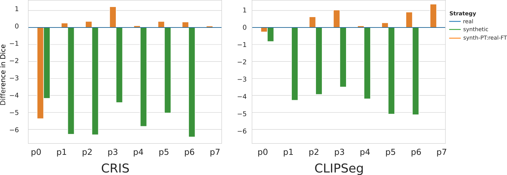
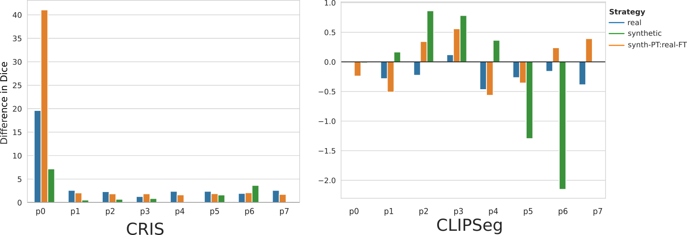

# Synthetic Boost: Leveraging Synthetic Data for Enhanced Vision-Language Segmentation in Echocardiography

by
Rabin Adhikari*,
Manish Dhakal*,
Safal Thapaliya*,
Kanchan Poudel,
Prasiddha Bhandari,
Bishesh Khanal
>*Equal contribution

This repository contains the data and source code used to produce the results presented in the
[4th International Workshop of Advances in Simplifying Medical UltraSound (ASMUS)](https://miccai-ultrasound.github.io/#/asmus23).

## Abstract

Accurate segmentation is essential for echocardiography-based assessment of cardiovascular diseases.
However, the variability among sonographers and the inherent challenges of ultrasound images hinder precise segmentation.
By leveraging the joint representation of image and text modalities, Vision-Language Segmentation Models (VLSMs) can incorporate rich contextual information, potentially aiding in accurate and explainable segmentation.
However, the lack of readily available data in echocardiography impedes the training of VLSMs.
In this study, we explore using synthetic datasets from Semantic Diffusion Models (SDMs) to enhance VLSMs for echocardiography segmentation.
We evaluate results for two popular VLSMs (CLIPSeg and CRIS) using seven different kinds of language prompts derived from several attributes, automatically extracted from echocardiography images, segmentation masks, and their metadata.
Our results show improved metrics and faster convergence when pretraining VLSMs on SDM-generated synthetic images before finetuning on real images.
The code, configs, and prompts are available [here](https://github.com/naamiinepal/synthetic-boost).

## Basic Achitecture of VLSMs

The key components in the architecture are a _Text Encoder_, an _Image Encoder_, a _Vision-Language Decoder (VLD)_, and an _Aggregator_.
The images and the corresponding prompts are passed to the CLIP image and text encoders, respectively.
The Aggregator generates intermediate representations utilizing image-level, sentence-level, or word-level representations to feed to the VLD.
The VLD outputs a binary mask for an image-text pair.

## Results

The following figure shows the difference in mean dice scores between different training strategies for CLIPSeg and CRIS for different prompts.

The following figure shows the difference between mean dice scores when the encoders are frozen and when the encoders are trained for different prompts.
CRIS's model performance improves when the encoders are trained along with the decoder.
In contrast, CLIPSeg's performance degrades when encoders are trained.

## Reproducibility

For reproducibility please refer [REPRODUCIBILITY.md](REPRODUCIBILITY.md).

## License

All Python source code (including `.py` and `.ipynb` files) is made available
under the MIT license.
You can freely use and modify the code, without warranty, so long as you provide attribution to the authors.
See [LICENSE](LICENSE) for the full license text.

The manuscript text (including all LaTeX files), figures, and data/models produced as part of this research are available under the [Creative Commons Attribution 4.0 License (CC-BY)](https://creativecommons.org/licenses/by/4.0/).
See [LICENSE](paper/LICENSE) for the full license text.
